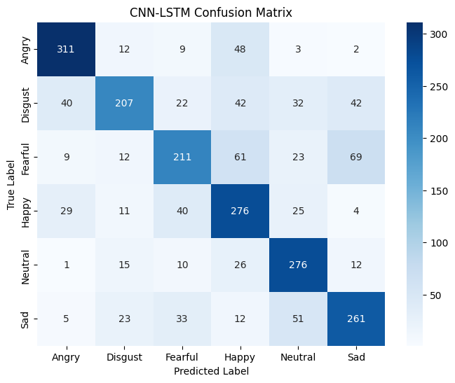

# 🎙️ Speech Emotion Recognition (SER) using CNN-LSTM and Wav2Vec2

This project focuses on building an intelligent system that recognizes human emotions from speech using two approaches:

1. A custom-built **CNN-LSTM model** trained on spectrogram features
2. A pretrained **Wav2Vec2.0 transformer model** used for raw waveform-based classification

## 🧠 Motivation

Human speech carries not only words, but emotions. Recognizing these emotions has applications in:

- Mental health monitoring
- Virtual assistants
- Human-computer interaction
- Call centers & customer service

## 🗂️ Datasets Used

The project combines multiple open-source datasets to improve generalization:

| Dataset | Emotions Covered                                              |
| ------- | ------------------------------------------------------------- |
| RAVDESS | Neutral, Calm, Happy, Sad, Angry, Fearful, Disgust, Surprised |
| CREMA-D | Angry, Disgust, Fearful, Happy, Neutral, Sad                  |
| TESS    | Angry, Disgust, Fearful, Happy, Neutral, Sad                  |
| SAVEE   | Angry, Disgust, Fearful, Happy, Neutral, Sad                  |

Only the **six common emotions** were retained:
**Angry, Happy, Sad, Fearful, Disgust, Neutral**

## Data Preprocessing

The data was preprocessed on google colab using data_preprocessing.ipynb

- Raw audio was loaded at 16kHz
- Spectrograms were extracted using MelSpectrogram + AmplitudeToDB
- Audio samples were padded/truncated to a fixed duration
- Labels were encoded using LabelEncoder
- Train/Validation/Test split with stratified sampling

## 📐 Model Architectures

### 🔷 CNN-LSTM (Custom Model)

- CNN layers extract local time-frequency features from spectrograms
- LSTM layers capture temporal emotional transitions
- Fully connected layers classify into emotion categories

### 🔷 Wav2Vec2.0 (Pretrained Transformer)

- Raw waveform passed to facebook/wav2vec2-base
- Hidden states pooled and fed to a classification head
- Only the classifier was fine-tuned

## Multiple Web Apps

To support fair comparison and separate behaviors, this project includes two Flask applications:

- app.py CNN-LSTM (custom) 6 classes: Angry, Happy, Sad, Fearful, Disgust, Neutral
- app_wav2vec.py Wav2Vec2 (pretrained, not fine-tuned) 4 classes: Angry, Happy, Sad, Neutral

Each app has its own interface but shares the same structure and workflow.

⚠️ Wav2Vec2 model currently supports only 4 classes due to label mismatch. Fine-tuning on the full 6-class dataset is planned for future work.

To run the Wav2Vec2 version:
python app_wav2vec.py

**Make sure the appropriate model and label encoder files are loaded inside models/.**

## 🧪 Evaluation Metrics

- Accuracy
- F1-score
- Confusion Matrix
- Classification Report

## Results

Our CNN-LSTM model achieved about 68% accuracy and f1-score of 67%
Here's the confusionmatrix across the 6 emotions

## 🚀 How to Run This Project (CNN-LSTM Only)

This project is split into two main stages:

1. Data preprocessing using data_preprocessing.ipynb
2. Model training and evaluation using model.ipynb

### 🧼 1. Preprocess the Data

📄 data_preprocessing.ipynb

This notebook handles:

- Loading multiple datasets (CREMA-D, RAVDESS, TESS, SAVEE)
  Original Datasets can be found here: https://www.kaggle.com/datasets/dmitrybabko/speech-emotion-recognition-en
- Normalizing sample rates and durations
- Generating Mel Spectrograms (torchaudio.transforms)
- Label encoding with LabelEncoder
- Saving the processed dataset for training

✅ Make sure this notebook saves:

- The final cleaned and preprocessed version with 3 columns: Dataset, Emotion and File
  Final Dataset can be found here: https://drive.google.com/file/d/1cn_J6rAs8Pv5xptm9DZPqwW8IsTM3jkt/view?usp=sharing

### 🧠 2. Train the CNN-LSTM Model

📄 model.ipynb

This notebook includes:

- Building the CNN-LSTM architecture
- Training with validation, early stopping
- Evaluation (accuracy, F1-score, confusion matrix)
- Saving the trained model (best_model.pt)

### 🌐 2. Run the Flask Web App (Locally)

📁 Web Interface
The Flask app loads your trained model and allows users to upload a .wav file and receive an emotion prediction.

⚙️ Steps:

- Clone this repo or open your local project
- Create a virtual environment (optional but recommended):
- Install dependencies (pip install -r requirements.txt)
- Run the app:(python app.py)
- Visit: http://127.0.0.1:5000
  Make sure these files exist before running the app:
- models/cnn_lstm_model.pth
- models/label_encoder.pkl

## 🐳 Docker Support

This project includes a Dockerfile for easy containerized deployment.

📦 **Build and Run the App with Docker**:
docker build -t ser-flask-app .

📦 **Run the Docker container**
docker run -p 5000:5000 ser-flask-app

Once running, visit
http://localhost:5000 to access the web app.

🗂️ Make sure the following are included in your project folder:

- app.py or app_wav2vec.py (depending on which app you're running)
- models/best_model.pt
- models/label_encoder.pkl
- requirements.txt
- Dockerfile
- templates/ and static/ folders

## 📚 Dependencies

- PyTorch
- torchaudio
- transformers
- librosa
- pandas / scikit-learn
- matplotlib / seaborn
- tqdm
- Flask

### 👩‍💻 Author

Souad Khalifeh
AI Engineer
souadmkhalifeh@gmail.com
